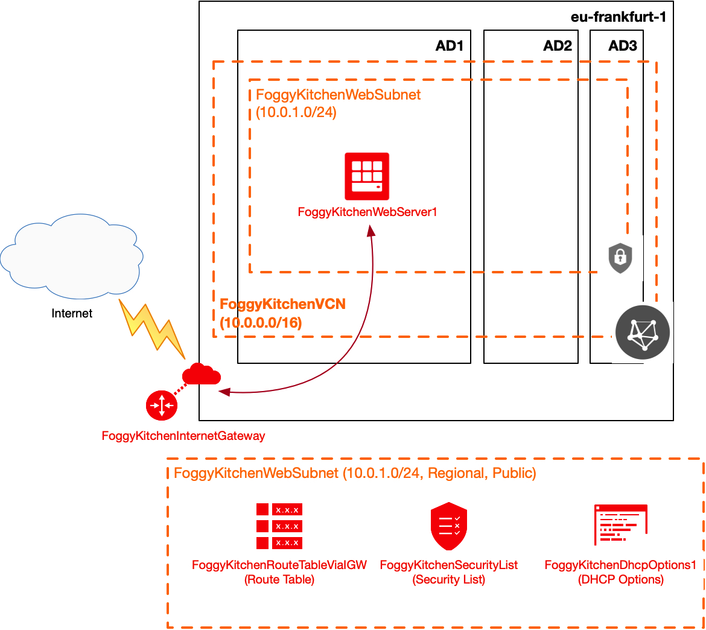

# Terraform OCI Flex Compute

## Project description

In this repository I have documented my hands-on experience with Terrafrom for the purpose of OCI Flex Compute Shapes deployment (new OCI feature released and documented [_here_](https://docs.cloud.oracle.com/en-us/iaas/releasenotes/changes/97196374-a7b3-4ac3-ad66-2cfbebcba39d/) and now supported by OCI Terraform Provider v3.94.0). This set of HCL based Terraform files can customized according to any requirements.  

## Topology Diagram 

With the usage of this example HCL code you can build topology documented by diagram below. 



## How to use code 

### STEP 1.

Clone the repo from github by executing the command as follows and then go to terraform-oci-flex-compute directory:

```
[opc@terraform-server ~]$ git clone https://github.com/mlinxfeld/terraform-oci-flex-compute.git
Cloning into 'terraform-oci-flex-compute'...
remote: Enumerating objects: 45, done.
remote: Counting objects: 100% (45/45), done.
remote: Compressing objects: 100% (31/31), done.
remote: Total 45 (delta 19), reused 40 (delta 14), pack-reused 0
Unpacking objects: 100% (45/45), done.

[opc@terraform-server ~]$ cd terraform-oci-flex-compute/

[opc@terraform-server terraform-oci-flex-compute]$ ls -latr
total 1044
drwxr-xr-x  57 opc opc 1824  2 gru 10:19 ..
drwxr-xr-x   9 opc opc  288  2 gru 10:19 .git
-rw-r--r--   1 opc opc  185  2 gru 10:20 compartment.tf
-rw-r--r--   1 opc opc  765  2 gru 10:20 datasources.tf
-rw-r--r--   1 opc opc  442  2 gru 10:20 dhcp_options.tf
-rw-r--r--   1 opc opc 1033  2 gru 10:20 httpd_on_webserver1.tf
-rw-r--r--   1 opc opc  250  2 gru 10:20 internet_gateway.tf
-rw-r--r--   1 opc opc  122  2 gru 10:20 output.tf
-rw-r--r--   1 opc opc  237  2 gru 10:20 provider.tf
-rw-r--r--   1 opc opc  431  2 gru 10:20 route.tf
-rw-r--r--   1 opc opc  715  2 gru 10:20 security_list.tf
-rw-r--r--   1 opc opc  501  2 gru 10:20 subnet1.tf
-rw-r--r--   1 opc opc  227  2 gru 10:20 vcn.tf
-rw-r--r--   1 opc opc  581  2 gru 10:25 variables.tf
-rwxr-xr-x   1 opc opc  677  2 gru 11:13 webserver1.tf
-rw-r--r--@  1 opc opc 7947  2 gru 11:44 README.md
drwxr-xr-x  17 opc opc  544  2 gru 11:44 .

```

### STEP 2.

Within web browser go to URL: https://www.terraform.io/downloads.html. Find your platform and download the latest version of your terraform runtime. Add directory of terraform binary into PATH and check terraform version:

```
[opc@terraform-server terraform-oci-flex-compute]$ export PATH=$PATH:/home/opc/terraform

[opc@terraform-server terraform-oci-flex-compute]$ terraform --version

Terraform v0.12.16

Your version of Terraform is out of date! The latest version
is 0.12.17. You can update by downloading from https://www.terraform.io/downloads.html
```

### STEP 3. 
Next create environment file with TF_VARs:

```
[opc@terraform-server terraform-oci-flex-compute]$ vi setup_oci_tf_vars.sh
export TF_VAR_user_ocid="ocid1.user.oc1..aaaaaaaaob4qbf2(...)uunizjie4his4vgh3jx5jxa"
export TF_VAR_tenancy_ocid="ocid1.tenancy.oc1..aaaaaaaas(...)krj2s3gdbz7d2heqzzxn7pe64ksbia"
export TF_VAR_compartment_ocid="ocid1.tenancy.oc1..aaaaaaaasbktyckn(...)ldkrj2s3gdbz7d2heqzzxn7pe64ksbia"
export TF_VAR_fingerprint="00:f9:d1:41:bb:57(...)82:47:e6:00"
export TF_VAR_private_key_path="/tmp/oci_api_key.pem"
export TF_VAR_region="eu-frankfurt-1"
export TF_VAR_private_key_oci="/tmp/id_rsa"
export TF_VAR_public_key_oci="/tmp/id_rsa.pub"

[opc@terraform-server terraform-oci-flex-compute]$ source setup_oci_tf_vars.sh
```

### STEP 4.
Run *terraform init* with upgrade option just to download the lastest neccesary providers:

```
[opc@terraform-server terraform-oci-flex-compute]$ terraform init -upgrade

Initializing the backend...

Initializing provider plugins...
- Checking for available provider plugins...
- Downloading plugin for provider "null" (hashicorp/null) 2.1.2...
- Downloading plugin for provider "random" (hashicorp/random) 2.2.1...
- Downloading plugin for provider "local" (hashicorp/local) 1.4.0...
- Downloading plugin for provider "oci" (hashicorp/oci) 3.64.0...

The following providers do not have any version constraints in configuration,
so the latest version was installed.

To prevent automatic upgrades to new major versions that may contain breaking
changes, it is recommended to add version = "..." constraints to the
corresponding provider blocks in configuration, with the constraint strings
suggested below.

* provider.local: version = "~> 1.4"
* provider.null: version = "~> 2.1"
* provider.random: version = "~> 2.2"

Terraform has been successfully initialized!

You may now begin working with Terraform. Try running "terraform plan" to see
any changes that are required for your infrastructure. All Terraform commands
should now work.

If you ever set or change modules or backend configuration for Terraform,
rerun this command to reinitialize your working directory. If you forget, other
commands will detect it and remind you to do so if necessary.
```

### STEP 5.
Run *terraform apply* to provision the content of this code (type **yes** to confirm the the apply phase):

```
[opc@terraform-server terraform-oci-flex-compute]$ terraform apply 

An execution plan has been generated and is shown below.
Resource actions are indicated with the following symbols:
  + create
 <= read (data resources)

Terraform will perform the following actions:

  # data.oci_core_vnic.FoggyKitchenWebserver1_VNIC1 will be read during apply

(...)

Plan: 26 to add, 0 to change, 0 to destroy.

Do you want to perform these actions?
  Terraform will perform the actions described above.
  Only 'yes' will be accepted to approve.


(...)

Apply complete! Resources: 26 added, 0 changed, 0 destroyed.

Outputs:

FoggyKitchenWebserver1_PublicIP = [
  "158.101.165.174",

(...)

```

### STEP 6.
After testing the environment you can remove the whole OCI infra. You should just run *terraform destroy* (type **yes** for confirmation of the destroy phase):

```
[opc@terraform-server terraform-oci-flex-compute]$ terraform destroy

oci_identity_compartment.FoggyKitchenCompartment: Refreshing state... [id=ocid1.compartment.oc1..aaaaaaaagillnk7ttj6wpdhmewpibpxc5gbmrfxdtmaa3gfgjzbudesm3tsq]
oci_core_virtual_network.FoggyKitchenVCN: Refreshing state... [id=ocid1.vcn.oc1.eu-frankfurt-1.amaaaaaadngk4gialu6ikx45brprlpzi2oyibbsl6slts36bar4vgcjlmgjq]
(...)

Plan: 0 to add, 0 to change, 26 to destroy.

Do you really want to destroy all resources?
  Terraform will destroy all your managed infrastructure, as shown above.
  There is no undo. Only 'yes' will be accepted to confirm.

  Enter a value: yes

(...)

oci_core_network_security_group.FoggyKitchenWebSecurityGroup: Destruction complete after 5s
oci_core_virtual_network.FoggyKitchenVCN: Destroying... [id=ocid1.vcn.oc1.iad.amaaaaaac3adhhqat3gn63eiilexiwzgyrjoi6few7dcf36ilddupukf6mpa]
oci_core_virtual_network.FoggyKitchenVCN: Destruction complete after 1s
oci_identity_compartment.FoggyKitchenCompartment: Destroying... [id=ocid1.compartment.oc1..aaaaaaaarrlkyjshc4i7gqr56sydav2lpcdhhqwy2b72mj6iruy3r4z3j7ra]
oci_identity_compartment.FoggyKitchenCompartment: Destruction complete after 0s

Destroy complete! Resources: 26 destroyed.
```
